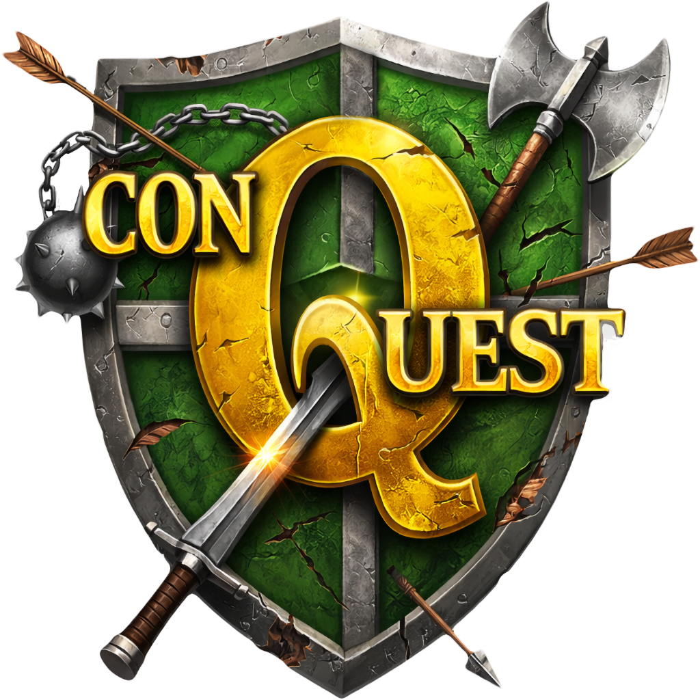

  

# ConQuest

**ConQuest** is a top-down tactical action game where territory, momentum, and calculated aggression decide victory.

Set in a fractured world of contested zones and hostile factions, the player navigates cities, districts, and battlefields where every route has a cost and every decision leaves a trace. Streets, rooftops, sewers, and interiors form layered traversal paths, each with its own risks and rewards.

Combat is fast, positional, and systemic rather than twitch-heavy. Success comes from controlling space, managing threat, and choosing when to push forward or disappear into the environment.

## Core Pillars

- **Territorial Control**  
  Progress is defined by conquest, not checkpoints. Areas are taken, lost, and retaken based on player action.

- **Layered Navigation**  
  Streets, rooftops, sewers, and interiors offer alternate routes, ambush opportunities, and escape paths.

- **Procedural Cities**  
  Districts are generated with consistent rules but varied layouts, ensuring replayability while preserving intentional design.

- **Risk vs Reward Exploration**  
  Detours may yield resources, upgrades, or tactical advantages, but rarely provide a free shortcut.

## Status

🚧 Early development / design-locked MVP phase  
Built with **Swift**, **SpriteKit**, and **SwiftUI**.

This repository will evolve alongside the game’s systems, generators, and combat mechanics.

---

*ConQuest is a long-term passion project exploring procedural design, tactical play, and readable systemic complexity.*
